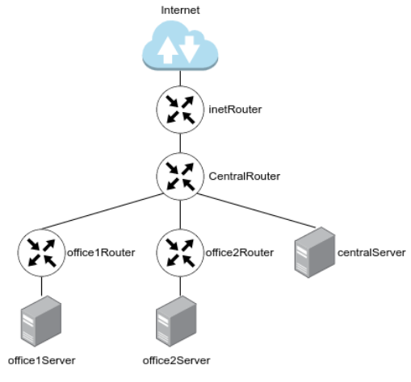

# Разворачиваем сетевую лабораторию

## Задание

Построить следующую сетевую архитектуру:



- **Сеть office1**:

  - **192.168.2.0/26**   - dev
  - **192.168.2.64/26**  - test servers
  - **192.168.2.128/26** - managers
  - **192.168.2.192/26** - office hardware

- **Сеть office2**:

  - **192.168.1.0/25**   - dev
  - **192.168.1.128/26** - test servers
  - **192.168.1.192/26** - office hardware

- **Сеть central**

  - **192.168.0.0/28**   - directors
  - **192.168.0.32/28**  - office hardware
  - **192.168.0.64/26**  - wifi

**В теоретической части требуется**:

- Найти свободные подсети.
- Посчитать количество узлов в каждой подсети, включая свободные.
- Указать широковещательный адрес для каждой подсети.
- Проверить, нет ли ошибок при разбиении.

**В практической части требуется**:

- Соединить офисы в сеть согласно логической схеме и настроить роутинг.
- Интернет-трафик со всех серверов должен ходить через **inetRouter**.
- Все сервера должны видеть друг друга (должен проходить **ping**)
- У всех новых серверов отключить дефолт на **NAT (eth0)**, который **vagrant** поднимает для связи.
- Добавить дополнительные сетевые интерфейсы, если потребуется.

## Теоретическая часть

### Сеть central

| имя сети        | сеть             | широковещательный | узлов |
|:----------------|:-----------------|------------------:|------:|
| directors       | 192.168.0.0/28   |      192.168.0.15 |    14 |
|                 | 192.168.0.16/28  |      192.168.0.31 |    14 |
| office hardware | 192.168.0.32/28  |      192.168.0.47 |    14 |
|                 | 192.168.0.48/28  |      192.168.0.63 |    14 |
| wifi            | 192.168.0.64/26  |     192.168.0.127 |    62 |
|                 | 192.168.0.128/25 |     192.168.0.255 |   126 |

### Сеть office2

| имя сети        | сеть             | широковещательный | узлов |
|:----------------|:-----------------|------------------:|------:|
| dev             | 192.168.1.0/25   |     192.168.1.127 |   126 |
| test servers    | 192.168.1.128/26 |     192.168.1.191 |    62 |
| office hardware | 192.168.1.192/26 |     192.168.1.255 |    62 |

### Сеть office1

| имя сети        | сеть             | широковещательный | узлов |
|:----------------|:-----------------|------------------:|------:|
| dev             | 192.168.2.0/26   |      192.168.1.63 |    62 |
| test servers    | 192.168.2.64/26  |     192.168.1.127 |    62 |
| managers        | 192.168.2.128/26 |     192.168.1.191 |    62 |
| office hardware | 192.168.2.192/26 |     192.168.1.255 |    62 |

## Практическая часть


Задание сделано на **rockylinux/9** версии **v4.0.0**. Для автоматизации процесса написан **Ansible Playbook** [playbook.yml](playbook.yml) который:

- включает **ip forwarding** на маршрутизаторах;
- настраивает **masquerade** на **inetRouter;
- настраивает сеть на всех узлах (через **nmcli**).

**Playbook** использует конфигурацию сети, определённую в [host_vars](host_vars):

- [inetRouter](host_vars/inetRouter.yml);
- [centralRouter](host_vars/centralRouter.yml);
- [office2Router](host_vars/office2Router.yml);
- [office1Router](host_vars/office1Router.yml);
- [centralServer](host_vars/centralServer.yml);
- [office2Server](host_vars/office2Server.yml);
- [office1Server](host_vars/office1Server.yml).

## Запуск

Необходимо скачать **VagrantBox** для **rockylinux/9** версии **v4.0.0** и добавить его в **Vagrant** под именем **rockylinux/9/v4.0.0**. Сделать это можно командами:

```shell
curl -OL https://app.vagrantup.com/rockylinux/boxes/9/versions/4.0.0/providers/virtualbox/amd64/vagrant.box
vagrant box add vagrant.box --name "rockylinux/9/v4.0.0"
rm vagrant.box
```

Для того, чтобы **vagrant 2.3.7** работал с **VirtualBox 7.1.0** необходимо добавить эту версию в **driver_map** в файле **/usr/share/vagrant/gems/gems/vagrant-2.3.7/plugins/providers/virtualbox/driver/meta.rb**:

```ruby
          driver_map   = {
            "4.0" => Version_4_0,
            "4.1" => Version_4_1,
            "4.2" => Version_4_2,
            "4.3" => Version_4_3,
            "5.0" => Version_5_0,
            "5.1" => Version_5_1,
            "5.2" => Version_5_2,
            "6.0" => Version_6_0,
            "6.1" => Version_6_1,
            "7.0" => Version_7_0,
            "7.1" => Version_7_0,
          }
```

После этого нужно сделать **vagrant up**.

Протестировано в **OpenSUSE Tumbleweed**:

- **Vagrant 2.3.7**
- **VirtualBox 7.1.0_SUSE r164728**
- **Ansible 2.17.4**
- **Python 3.11.10**
- **Jinja2 3.1.4**

## Проверка

Выполним трассировку со все серверов:

```text
❯ vagrant ssh office2Server -c 'tracepath -n ihome.ru'
 1?: [LOCALHOST]                      pmtu 1500
 1:  192.168.1.1                                           0.225ms
 1:  192.168.1.1                                           0.119ms
 2:  192.168.255.5                                         0.283ms
 3:  192.168.255.1                                         0.389ms
 4:  no reply
 5:  no reply
 6:  no reply
 7:  100.115.0.1                                           6.926ms asymm  4
 8:  212.188.1.6                                           6.115ms asymm  4
 9:  212.188.1.5                                           6.417ms asymm  4
10:  195.34.53.206                                         5.838ms asymm  4
11:  212.188.12.117                                        6.305ms asymm  4
12:  85.112.122.5                                          6.093ms asymm  4
13:  85.112.112.20                                         7.050ms !H
     Resume: pmtu 1500

❯ vagrant ssh office1Server -c 'tracepath -n ihome.ru'
 1?: [LOCALHOST]                      pmtu 1500
 1:  192.168.2.129                                         0.243ms
 1:  192.168.2.129                                         0.121ms
 2:  192.168.255.9                                         0.278ms
 3:  192.168.255.1                                         0.381ms
 4:  no reply
 5:  no reply
 6:  no reply
 7:  100.115.0.1                                           6.358ms asymm  4
 8:  212.188.1.6                                           5.378ms asymm  4
 9:  no reply
10:  195.34.53.206                                         6.546ms asymm  4
11:  212.188.12.117                                        6.187ms asymm  4
12:  85.112.122.13                                         6.552ms asymm  4
13:  85.112.112.20                                         6.861ms !H
     Resume: pmtu 1500

❯ vagrant ssh centralServer -c 'tracepath -n ihome.ru'
 1?: [LOCALHOST]                      pmtu 1500
 1:  192.168.0.1                                           0.213ms
 1:  192.168.0.1                                           0.106ms
 2:  192.168.255.1                                         0.262ms
 3:  no reply
 4:  no reply
 5:  no reply
 6:  100.115.0.1                                           5.970ms asymm  3
 7:  212.188.1.6                                           5.442ms asymm  3
 8:  no reply
 9:  195.34.53.206                                         6.410ms asymm  3
10:  212.188.12.117                                        6.414ms asymm  3
11:  85.112.122.5                                          7.019ms asymm  3
12:  85.112.112.20                                         6.867ms !H
     Resume: pmtu 1500
```

Видно, что адрес в сети Интернет доступен и все пакеты проходят через **inetRouter** (192.168.255.1).
